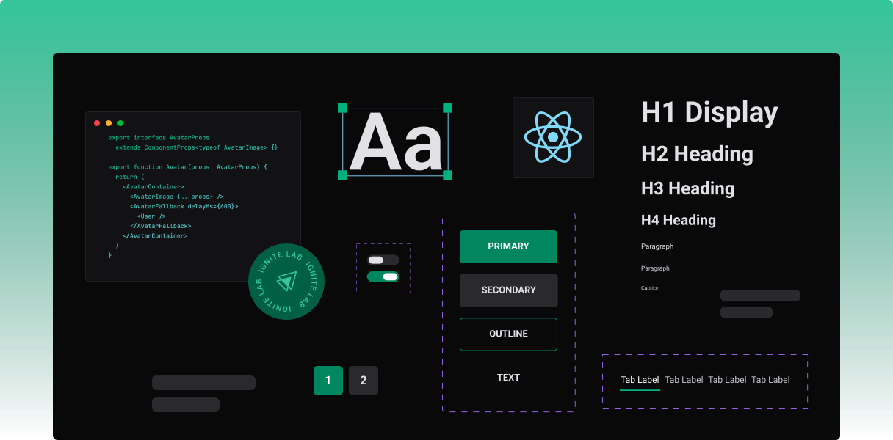
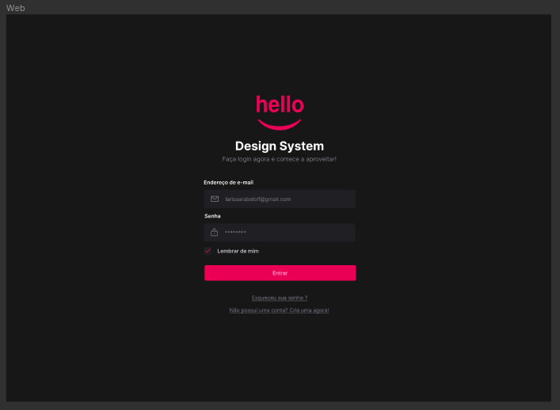
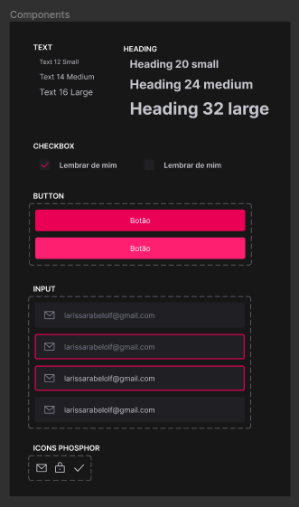
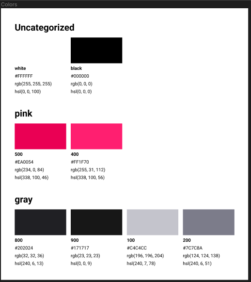
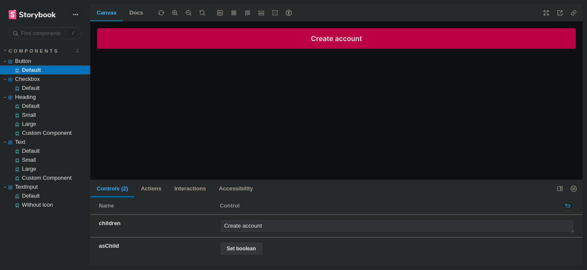
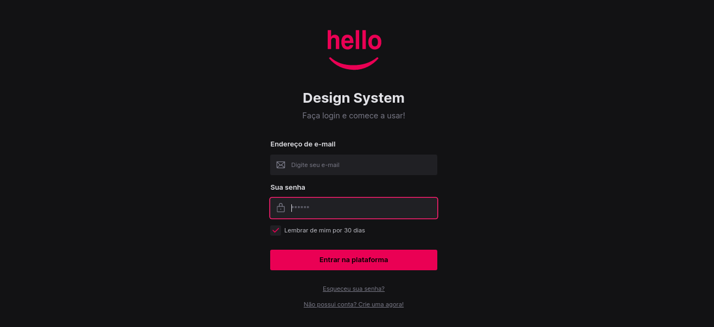

<div align="center">

  
  <h1>Do figma ao código</h1>
  <p>
    Rocketseat · Ignite Lab · 2022
  </p>

<!-- Badges -->
<p>

</p>

<h4>
    <a href="https://www.figma.com/file/6xrdqvBpvBhY0IXPyDkspc/Design-System?node-id=0%3A1" target="_blank" >Figma Style Guide</a>
  <span> · </span>
    <a href="https://laripeanuts.github.io/rs-ignitelab-designsystem/">Storybook Deploy</a>
</h4>
</div>

<br />

## 💡 Projeto

Sintetizar e elaborar em um pequeno escopo o desenvolvimento de um projeto completo de *design system*.


<!-- [Versão em português](./README-ptbr.md) -->

## 🎯 Objetivos

Desenvolver um *design system* com base em um *style guide* do Figma, utilizando as tecnologias e ferramentas como React, Tailwind, Storybook.

- [x] Desenvolver Tela de Login no Figma
- [x] Desenvolver Style Guide no Figma
- [x] Reproduzir Style Guide no Storybook
- [x] Reproduzir Tela de Login no React com Typescript
- [x] Criar CI do deploy do Storybook
- [x] Fazer deploy do Storybook no Github Pages

## 🥳 Aplicação 

### Figma e Style Guide · [DEMO](https://www.figma.com/file/6xrdqvBpvBhY0IXPyDkspc/Design-System?node-id=0%3A1)

<p align="center">
  
  
  
</p>

### Storybook · [DEMO](https://laripeanuts.github.io/rs-ignitelab-designsystem/)

<p align="center">
  
</p>

### Web

<p align="center">
  
</p>

## 💻 Feito com

[](https://developer.mozilla.org/pt-BR/docs/Web/JavaScript)
[](https://www.typescriptlang.org/)
[](https://pt-br.reactjs.org/)
[](https://developer.mozilla.org/pt-BR/docs/Web/HTML)
[](https://developer.mozilla.org/pt-BR/docs/Web/CSS)
[](https://tailwindcss.com/)
[](https://storybook.js.org/)
[](https://github.com/features/actions)
[](https://pages.github.com/)
## 🛠️ Ferramentas

[](https://www.figma.com/)
[](https://code.visualstudio.com/)
[](https://pop.system76.com/)

## 🦸‍♂️ Tecnologias de suporte

- Phosphor (Icons)
- Radix UI (Modal)
- Axios (HTTP Client)
- MSW (Mock Server)

## 🚀 Execute o projeto

Clone o projeto

```bash
  git clone https://github.com/laripeanuts/rs-ignitelab-designsystem
```

Vá para a raiz do diretório

```bash
  cd rs-ignitelab-designsystem
```

Instale as dependências

```bash
  pnpm install
```

Inicie o ambiente de desenvolvimento

```bash
  pnpm run dev
```

Inicie o Storybook

```bash
  pnpm run storybook
```

<p align="center">Copyright 2022 ☕<a href="https://github.com/laripeanuts"> laripeanuts</a></p>